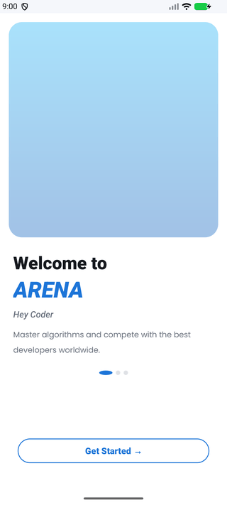
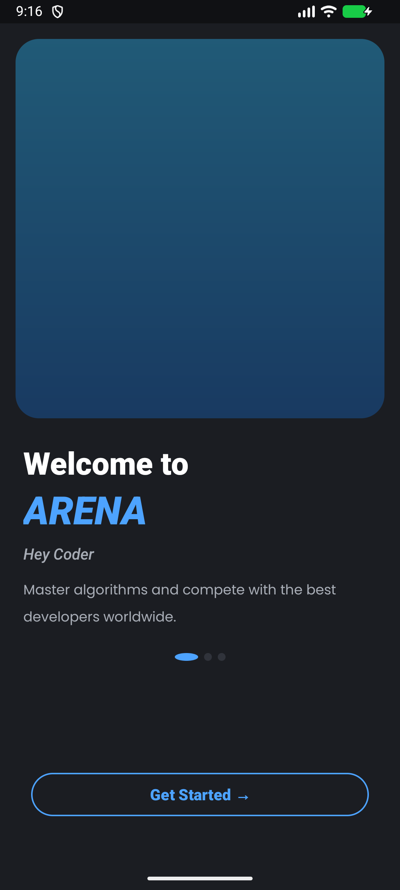
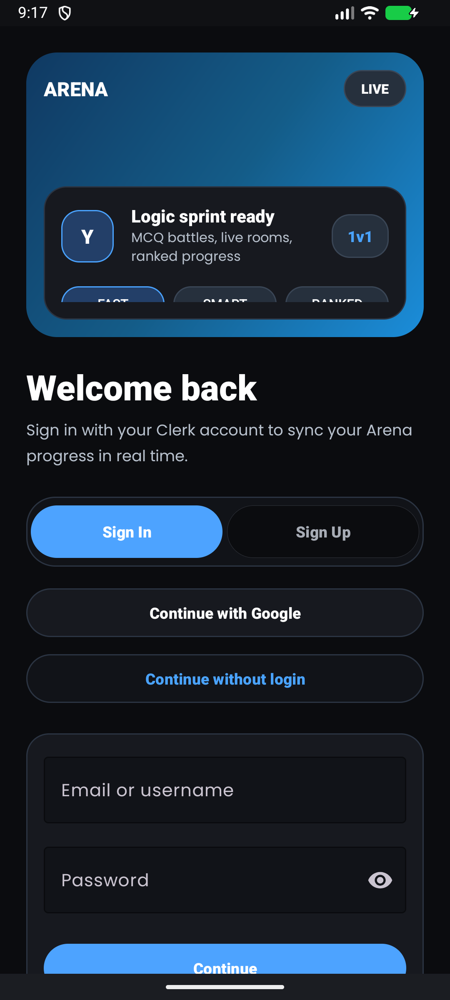
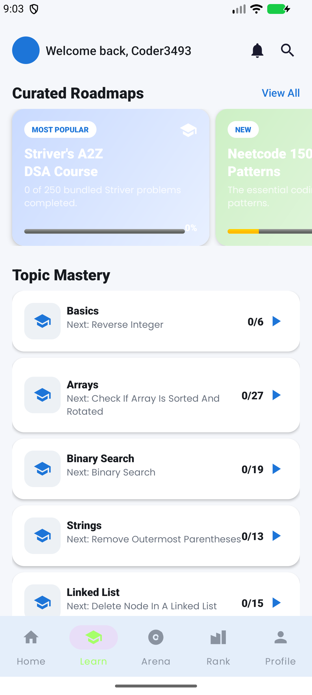
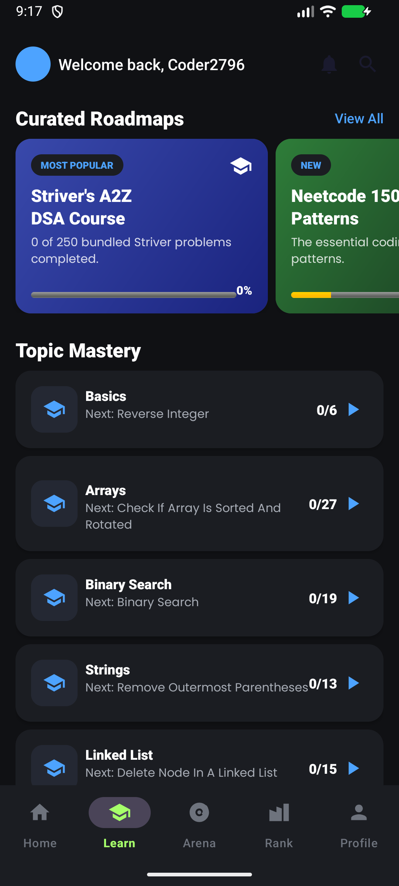
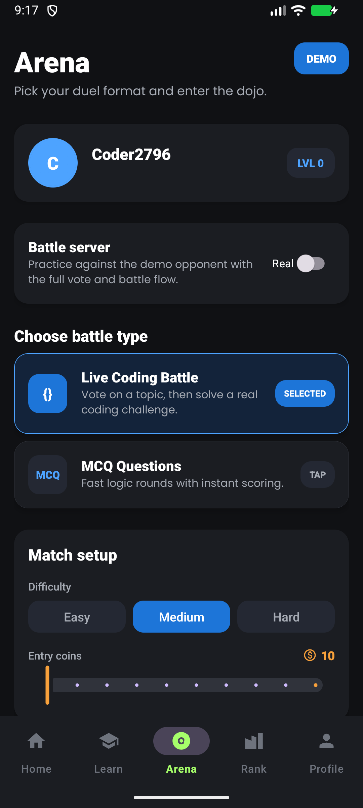
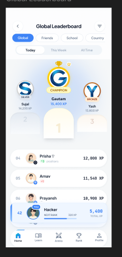
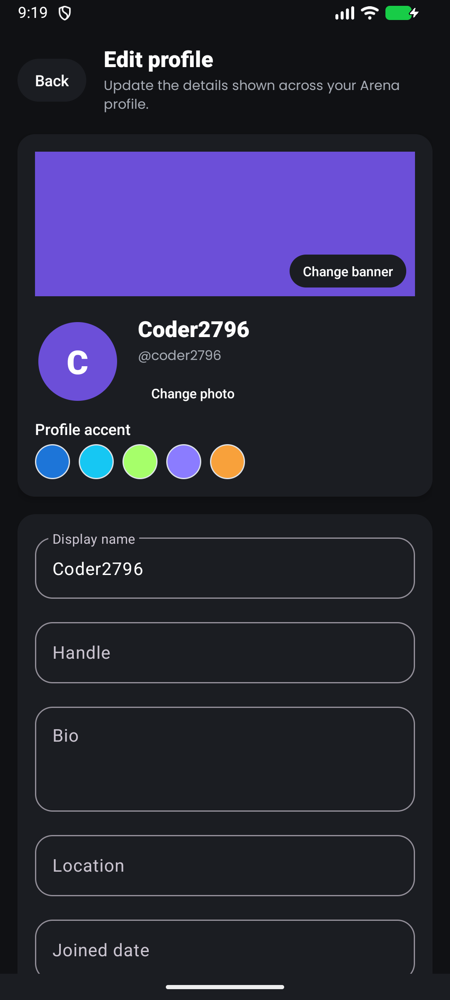

# Coding Arena

Coding Arena is an Android coding-practice app built around a competitive learning experience. It includes authentication, profile management, a Striver A2Z problem sheet, leaderboards, arena-style coding battles, and an in-app code compiler for solving questions.

## App Screenshots

<div align="center">
  
  <br>
  <strong>Animated preview of the updated dark-mode experience</strong>
</div>

<br>

| Splash & Onboarding | Authentication |
| --- | --- |
| <br><strong>Lottie Splash</strong><br><sub>Animated coding intro with the ARENA wordmark.</sub> | <br><strong>Onboarding</strong><br><sub>Dark-mode welcome screen for new coders.</sub> |
| <br><strong>Auth Hub</strong><br><sub>Sign in, sign up, Google login, and guest mode.</sub> | <br><strong>Home Dashboard</strong><br><sub>XP, streak, daily challenge, and continue learning cards.</sub> |

| Learning & Battles | Rankings & Profile |
| --- | --- |
| <br><strong>Learn</strong><br><sub>Roadmaps and topic mastery for structured practice.</sub> | <br><strong>Arena</strong><br><sub>Battle setup for live coding and MCQ duels.</sub> |
| <br><strong>Leaderboard</strong><br><sub>Readable dark-mode ranks, XP, and player standings.</sub> | <br><strong>Edit Profile</strong><br><sub>Profile customization with accents, banner, and user details.</sub> |

## Features

- Clerk authentication with sign in, sign up, Google sign-in, logout, and guest mode.
- Profile screen with registered email, editable personal details, and synced stats such as points, rank, level, and streak.
- Striver A2Z sheet support using the bundled JSON question data.
- In-app problem solver and compiler powered by Judge0 CE.
- API-backed app data through the existing backend endpoints instead of direct database access.
- Android UI built from the provided Figma design assets and XML layouts.

## Tech Stack

- Java
- Android XML layouts
- AndroidX and Material Components
- Gradle
- Retrofit, OkHttp, and Gson
- Clerk Android SDK
- Judge0 CE compiler API
- Socket.IO client

## Project Structure

```text
CODING_ARENA/
+-- Arena/
|   +-- app/
|   |   +-- src/main/java/com/arena/app/   # Android source code
|   |   +-- src/main/res/                  # XML layouts, drawables, values
|   |   +-- src/main/assets/striver_a2z.json
|   +-- android_integration_guide.md
|   +-- build.gradle
|   +-- settings.gradle
+-- Arena-debug.apk
+-- README.md
```

## Getting Started

### 1. Clone the repository

```bash
git clone https://github.com/Imsujal16/CODING_ARENA.git
cd CODING_ARENA/Arena
```

### 2. Open in Android Studio

1. Open Android Studio.
2. Choose **Open**.
3. Select the `Arena` folder.
4. Wait for Gradle sync to complete.
5. Run the app on an emulator or a physical Android device.

### 3. Build the APK

From the `Arena` folder:

```powershell
.\gradlew.bat assembleDebug
```

The generated debug APK will be available at:

```text
Arena/app/build/outputs/apk/debug/app-debug.apk
```

The repository may also include a copied debug APK at:

```text
Arena-debug.apk
```

## Configuration

The app currently uses the deployed API base URL configured in:

```text
Arena/app/src/main/java/com/arena/app/utils/Constants.java
```

Current API base:

```text
https://leetcodee-sigma.vercel.app/api/
```

For local backend testing, the Gradle config supports values in `Arena/local.properties`:

```properties
arena.emulator.baseUrl=http://10.0.2.2:3000/
arena.device.baseUrl=http://YOUR_COMPUTER_LOCAL_IP:3000/
arena.emulator.socketUrl=http://10.0.2.2:3001
arena.device.socketUrl=http://YOUR_COMPUTER_LOCAL_IP:3001
```

When testing on a real phone, use your computer's local network IP instead of `localhost`.

## Authentication Notes

This app uses Clerk for authentication. Google sign-in must also be enabled and configured inside the Clerk dashboard.

For Google sign-in on Android, make sure Clerk and Google credentials match:

- Android package name: `com.arena.app`
- Correct SHA-1 fingerprint for the debug or release keystore
- Google OAuth provider enabled in Clerk
- Clerk publishable key configured in the Android app

Guest mode lets users enter the app without an account. Guest profile data is local-only and should not be treated as a real authenticated backend user.

## API And Database Safety

Do not put `DATABASE_URL` or any private database credentials inside the Android app. Mobile apps can be decompiled, so secrets placed in the APK can be extracted.

The Android app should communicate only with backend API endpoints. The existing integration guide is here:

```text
Arena/android_integration_guide.md
```

## Striver A2Z Sheet

The Striver sheet question data is bundled in the app assets:

```text
Arena/app/src/main/assets/striver_a2z.json
```

There is also a root copy inside the Android project:

```text
Arena/striver_a2z.json
```

## Useful Commands

```powershell
# Run Gradle sync/build checks
.\gradlew.bat build

# Build debug APK
.\gradlew.bat assembleDebug

# Clean build files
.\gradlew.bat clean
```

## License

No license has been specified yet.
